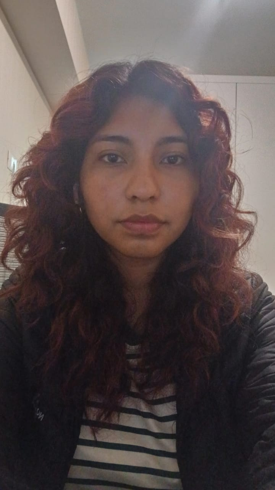
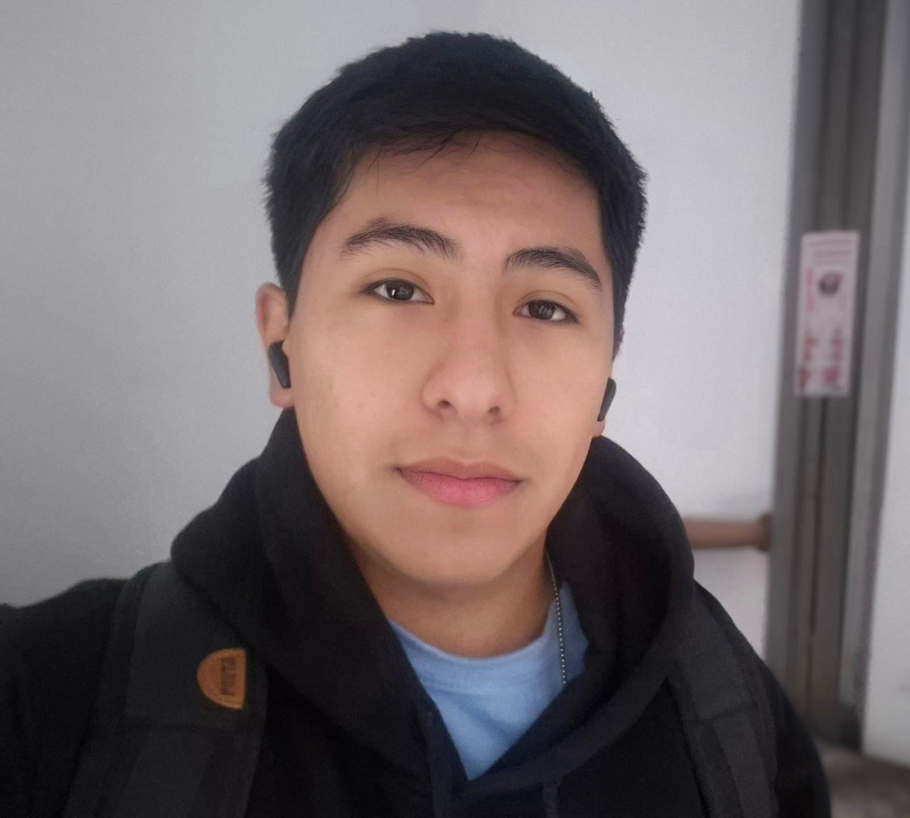
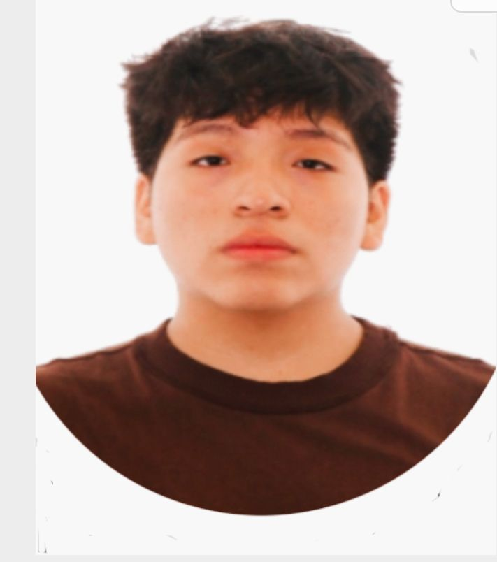

# EL PODEROSISIMO GRUPO 2

# 🎓DESCRIPCIÓN DEL GRUPO
Somos estudiantes de Ingeniería Biomédica de la PUCP-UPCH, pertenecientes al horario B401 del curso “Fundamentos de Biodiseño”. Este repositorio ha sido creado con el propósito de documentar y compartir nuestro trabajo grupal, en el que integramos conocimientos de programación, diseño electrónico, modelado 3D y diversas técnicas de manufactura digital. A través de este proyecto, buscamos fomentar la innovación tecnológica en el área de la salud y aportar con soluciones que respondan a necesidades reales de la sociedad peruana, promoviendo una mejor calidad de vida para las personas que enfrentan retos médicos en su día a día.

# 🧑‍🤝‍🧑DESCRIPCIÓN DE MIEMBROS DEL GRUPO
**1.) Leonela Encarnacion**

**EDAD:** 18 AÑOS

**PASATIEMPO:** Le gusta realizar manualidades, escuchar música y le interesa el área de biomecanica y rehabilitación

**ROL:**
- Hace los bocetos
- Ayuda con maquetas o prototipos simples en 3D.

**2.) Grecia Gutierrez**

**EDAD:** 18 AÑOS

**PASATIEMPO:** Tocar instrumentos musicales. Ella gustaria lograr contribuir al desarrollo de la ciencia y transformarla en ayuda a otros Biomecanica

**ROL:**
- Coordina al grupo
- Reparte tareas
- Asegura que todos cumplan con lo acordado.

**2.) Thiago Arroyo**

**EDAD:** 18 AÑOS

**PASATIEMPO:** Disfruta armando y desarmando aparatos electrónicos, además de jugar videojuegos.

**ROL:**
- Apoya en la conexión de cables y sensores.
- Revisa el funcionamiento de los circuitos básicos.
- Colabora en las pruebas del prototipo.
- Ayuda a conseguir los materiales electrónicos necesarios.

**2.) Larry Cardenas**

**EDAD:** 17 AÑOS

**PASATIEMPO:** Le gusta escribir, ver películas y salir a caminar.

**ROL:**
- Escribe los informes del proyecto.
- Organiza la información en el repositorio.
- Corrige errores ortográficos y de redacción.
- Apoya en presentaciones o resúmenes del trabajo.

